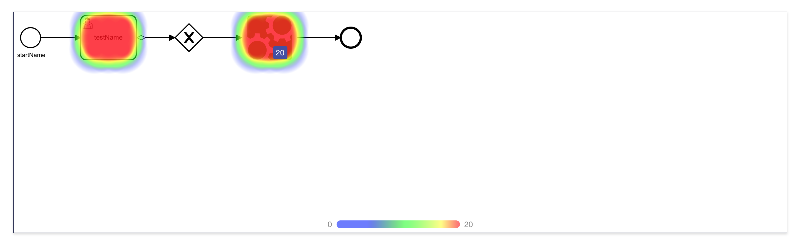
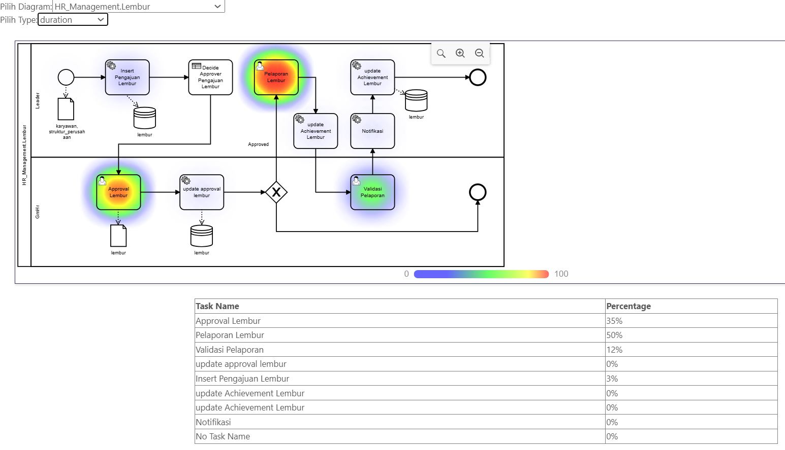
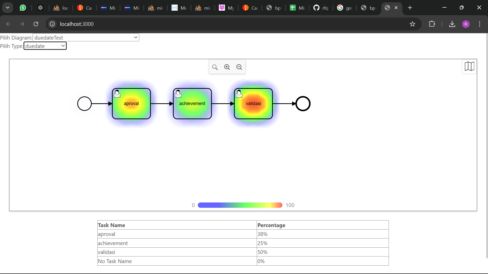

## heatmap integration into bpmn

If you encounter issues running "npm install", try the following steps:

1. run "yarn install"
2. Run "npm install --legacy-peer-deps" if the default command doesn't work.
3. If that still doesn't work, you can use "npm install --force". However, this is not recommended as it might cause unexpected issues.

"The server will run on port 3000."

The main file that can be easily modified is located at src/app.jsx. You can update this file to customize the application's behavior and appearance.

Example for HR_Management: Lembur flow in the duration option:

Example for dummy flow in the due date option:

